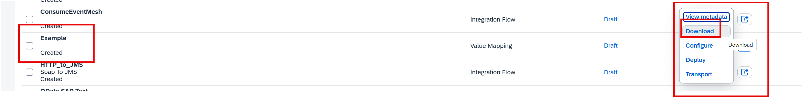
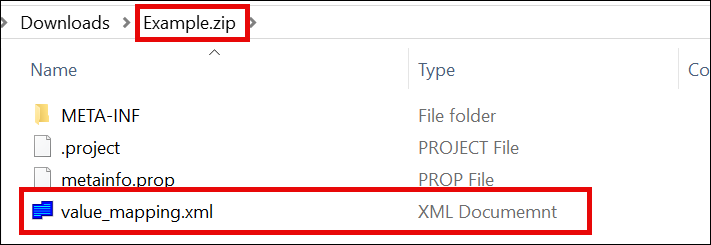
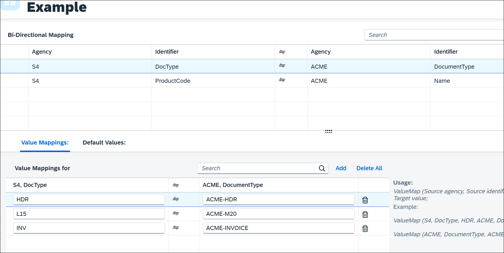
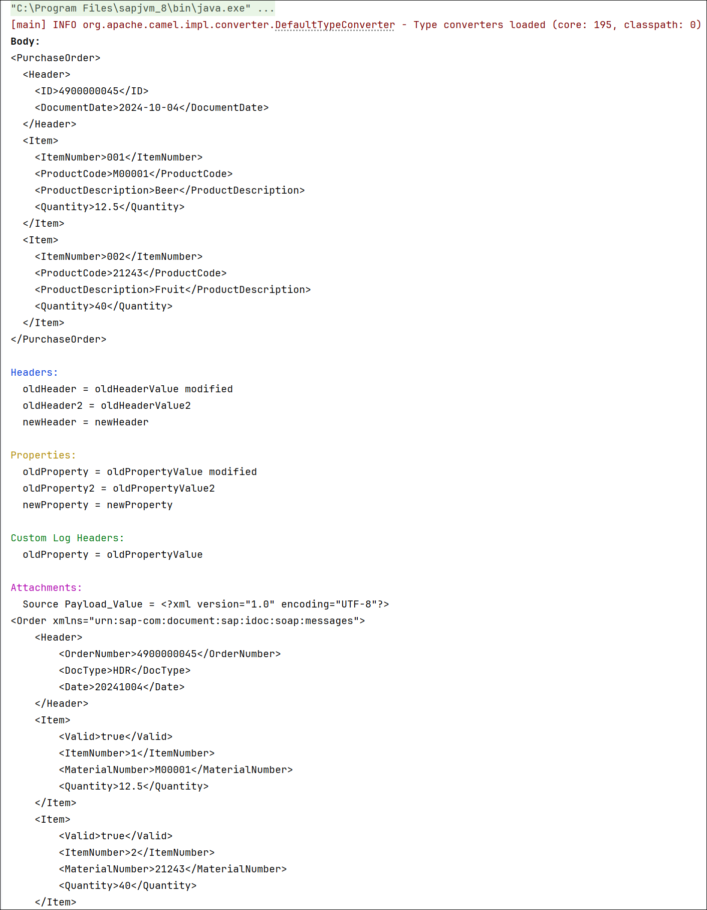

# Setup IntelliJ IDEA for Groovy Script

## Download IntelliJ IDEA and Groovy Script

* Download Latest versions via links below, or check the [files](./files) folder
* Download [SAP JVM](https://tools.hana.ondemand.com/#cloud)
* Download [Groovy Script 2.4.21](https://groovy.apache.org/download.html)
* Download [IntelliJ IDEA Community Edition](https://www.jetbrains.com/idea/download/?section=windows)
* Download [Script API](https://tools.hana.ondemand.com/#cloudintegration)
* Download and install [nvm / nodejs](https://github.com/coreybutler/nvm-windows/releases), this allows you to install multiple nodejs versions and switch between runtime versions.

 
## Setup IntelliJ IDEA for Creating Groovy Script projects

* Start IDEA and create a new Project
  * Name: GroovyScripts
  * Location: d:\
  * Language: Groovy
  * Build system: IntelliJ
  * JDK: sap-1.8, Point to c:\program files\sapjvm_8 folder
  * Groovy SDK: 2.4.21


* Configure the Modules in the Project Structure : choose: **File - Project Structure**
  * Goto **Project Settings - Modules**
  * Select Sources Tab
  * Unmark the *Sources* from the **src** folder
  * Create new **main** and **test** folders in the **src** folder
  * Mark the *Sources* to the **main** folder
  * Mark the *Tests* tab to the **test** folder
  * Create new **data** in the root folder
  * Create new **in** and **out** folders in the **data** folder
  
* Configure the Libraries in the Project Structure: choose: **File - Project Structure**
  * Download the two jar files from this Github files folder and put them in the **lib** folder of this project.
  * One by One add the following Java files to the project
    * camel-core-2.24.1.jar
    * cpi-mock-mapping.msg.jar
  * Add the following Maven file to the project
    * slf4j.simple:2.0.16 (latest version)
  * Press Apply to save the changes
  
* Restart IDEA

## Create Code Templates
### Groovy Script CPI SAP
* Create a **Groovy Script like standard CPI SAP** Code Template
  * In the menu bar, choose **File - Settings**
  * Then under **Editor - File and Code Templates** use the (+) Sign and add the script: **CPI Script SAP**
  * and paste this code
``` Groovy Script
/* Refer the link below to learn more about the use cases of script.
https://help.sap.com/viewer/368c481cd6954bdfa5d0435479fd4eaf/Cloud/en-US/148851bf8192412cba1f9d2c17f4bd25.html

If you want to know more about the SCRIPT APIs, refer the link below
https://help.sap.com/doc/a56f52e1a58e4e2bac7f7adbf45b2e26/Cloud/en-US/index.html */
import com.sap.gateway.ip.core.customdev.util.Message;
import java.util.HashMap;

def Message processData(Message message) {
    //Body
    def body = message.getBody();
/*To set the body, you can use the following method. Refer SCRIPT APIs document for more detail*/
    //message.setBody(body + " Body is modified");
    //Headers
    def headers = message.getHeaders();
    def value = headers.get("oldHeader");
    message.setHeader("oldHeader", value + " modified");
    message.setHeader("newHeader", "newHeader");
    //Properties
    def properties = message.getProperties();
    value = properties.get("oldProperty");
    message.setProperty("oldProperty", value + " modified");
    message.setProperty("newProperty", "newProperty");
    return message;
}
```
### Groovy Script for CPI
* Create a **Groovy Script for CPI** Code Template
  * In the menu bar, choose **File - Settings**
  * Then under **Editor - File and Code Templates** use the (+) Sign and add the script: **CPI Script**
  * and paste this code
``` Groovy Script
import com.sap.gateway.ip.core.customdev.util.Message;
import com.sap.it.api.mapping.ValueMappingApi;
import com.sap.it.api.ITApiFactory;
import groovy.xml.MarkupBuilder
import java.time.LocalDate
import java.time.format.DateTimeFormatter

def Message processData(Message message) {
    def messageLog = messageLogFactory.getMessageLog(message)
    def sourceMessage = message.getBody(String)
    //Body
    Reader reader = message.getBody(Reader)
    def Order = new XmlSlurper().parse(reader)
    Writer writer = new StringWriter()
    def builder = new MarkupBuilder(writer)

    ValueMappingApi api = ITApiFactory.getService(ValueMappingApi, null)

    def sourceDocType = Order.Header.DocType as String;

    def items = Order.Item.findAll { it.Valid.text() == 'true' }
    builder.PurchaseOrder {
        'Header' {
            'ID' Order.Header.OrderNumber
            'DocumentDate' LocalDate.parse(Order.Header.Date.text(), DateTimeFormatter.ofPattern('yyyyMMdd')).format(DateTimeFormatter.ofPattern('yyyy-MM-dd'))
            if (!items.size())
                'DocumentType' api.getMappedValue('S4', 'DocType', sourceDocType, 'ACME', 'DocumentType')
        }

        items.each { item ->
            'Item' {
                'ItemNumber' item.ItemNumber.text().padLeft(3, '0')
                'ProductCode' item.MaterialNumber
                'ProductDescription' api.getMappedValue('S4', 'ProductCode', item.MaterialNumber.text(), 'ACME', 'Name')
                'Quantity' item.Quantity
            }
        }
    }

    message.setBody(writer.toString())
    //Headers
    def headers = message.getHeaders();
    def value = headers.get("oldHeader");
    message.setHeader("oldHeader", value + " modified");
    message.setHeader("newHeader", "newHeader");
    //Properties
    def properties = message.getProperties();
    value = properties.get("oldProperty");
    message.setProperty("oldProperty", value + " modified");
    message.setProperty("newProperty", "newProperty");

    messageLog.addCustomHeaderProperty("oldProperty", value as String)
    messageLog.addAttachmentAsString("Source Payload", sourceMessage, "text/xml")

    return message;
}
```  
### Groovy Script for Testing CPI Script
* Create a **Groovy Script for Testing CPI Script** Code Template
  * In the menu bar, choose **File - Settings**
  * Then under **Editor - File and Code Templates** use the (+) Sign and add the script: **Test CPI Script**
  * and paste this code
  * ValueMapping values directly in the test script
  
  * Or ValueMapping via file
  * This file can be extraced from the zip file when you download a ValueMapping from CPI.

   
``` 
import com.sap.it.api.mapping.ValueMappingApi
import com.themuth.customdev.util.*

Mapping mapping = new Mapping()
ValueMappingApi vmapi = ValueMappingApi.getInstance()

def bodyFile = new File('../../data/in/xxx.xml')
def scriptFile = '../main/xxx.groovy'
// Set exchange headers
// if no headers then 
//def aHeaders = [:]
def aHeaders = ["oldHeader":"oldHeaderValue",
                "oldHeader2":"oldHeaderValue2"]
// Set exchange properties
// if no properties then
//def aProperties = [:]
def aProperties = ["oldProperty":"oldPropertyValue",
                   "oldProperty2":"oldPropertyValue2"]
// Inline Value Mapping
vmapi.addEntry('S4', 'Inline', 'In', 'ACME', 'Output', 'Out')
// File Based Value Mapping
mapping.loadValueMappings('../../data/ValueMappings/Example/value_mapping.xml');


//Run the test
RunTest test = new RunTest()
test.run(bodyFile,
         scriptFile,
         aHeaders,
         aProperties,
         true, true, true, true, true, true)
```  


## Create Test Example
### Value Mapping Example
* **DocType**

* **ProductCode**


### With inline value mapping values
In this test example we are mocking the Value Mappings in the test script:

* In folder **in** create a new file **xxx.xml** and put in the following code
```
    <Order>
        <Header>
            <OrderNumber>4900000045</OrderNumber>
            <DocType>HDR</DocType>
            <Date>20241004</Date>
        </Header>
        <Item>
            <Valid>true</Valid>
            <ItemNumber>1</ItemNumber>
            <MaterialNumber>M00001</MaterialNumber>
            <Quantity>12.5</Quantity>
        </Item>
        <Item>
            <Valid>true</Valid>
            <ItemNumber>2</ItemNumber>
            <MaterialNumber>21243</MaterialNumber>
            <Quantity>40</Quantity>
        </Item>
    </Order>
```  
  * In folder **src/main** right click and select **New - CPI Script** and name it **xxx** 
  * In folder **src/test** right clikc and select **New - Test CPI Script** and name it **xxxTest**
  * Create an new folder **ValueMappings** in the folder **data**
  * Create a new folder **Example** in the folder **ValueMappings**
  * Copy the file **value_mapping.xml** that is in this Github folder files and save it in the new folder **Example**
  * run your test script
    * Right click on the **xxxTest.groovy** file in the **test** folder and select **Run 'xxxTest'**
    * This should give you the following result:




## Basic Project Layout


## Resources
* [https://github.com/NL4BLeonBoeijen/sap-cpi-mocks](https://github.com/NL4BLeonBoeijen/sap-cpi-mocks)
* [https://github.com/equaliseit/sap-cpi-mocks/tree/main](https://github.com/equaliseit/sap-cpi-mocks/tree/main)
