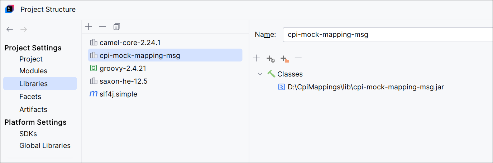
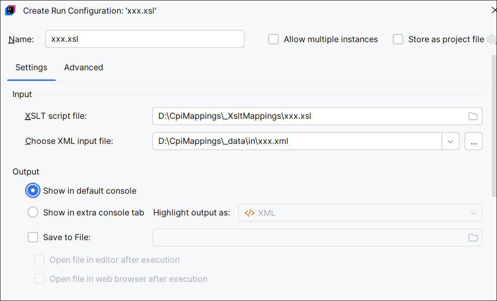
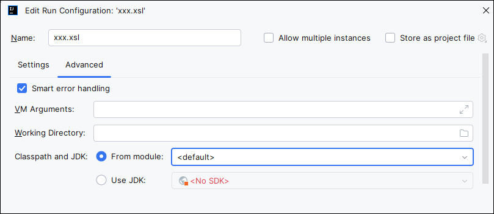
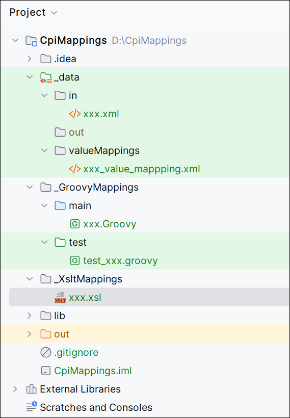

<!-- TOC start (generated with https://github.com/derlin/bitdowntoc) -->

- [Setup IntelliJ IDEA for Groovy Script and Xslt](#setup-intellij-idea-for-groovy-script-and-xslt)
   * [Download IntelliJ IDEA and Groovy Script](#download-intellij-idea-and-groovy-script)
   * [Setup IntelliJ IDEA for Building and testing CPI Groovy Script and Xslt](#setup-intellij-idea-for-building-and-testing-cpi-groovy-script-and-xslt)
   * [Create Code Templates](#create-code-templates)
      + [Groovy Script CPI SAP](#groovy-script-cpi-sap)
      + [Groovy Script for CPI](#groovy-script-for-cpi)
      + [Groovy Script for Testing CPI Script](#groovy-script-for-testing-cpi-script)
   * [Create Test Example](#create-test-example)
      + [Value Mapping Example](#value-mapping-example)
      + [With inline value mapping values](#with-inline-value-mapping-values)
   * [Add Xslt](#add-xslt)
      + [Create your xsl file](#create-your-xsl-file)
      + [Configure and run xsl file](#configure-and-run-xsl-file)
   * [Full Project Layout](#full-project-layout)
   * [Resources](#resources)

<!-- TOC end -->

<!-- TOC --><a name="setup-intellij-idea-for-groovy-script-and-xslt"></a>
# Setup IntelliJ IDEA for Groovy Script and Xslt

<!-- TOC --><a name="download-intellij-idea-and-groovy-script"></a>
## Download IntelliJ IDEA and Groovy Script

* Download Latest versions via links below, or check the [files](./files) folder
* Download [SAP JVM](https://tools.hana.ondemand.com/#cloud)
* Download [Groovy Script 2.4.21](https://groovy.apache.org/download.html)
* Download [IntelliJ IDEA Community Edition](https://www.jetbrains.com/idea/download/?section=windows)
* Download and install [nvm / nodejs](https://github.com/coreybutler/nvm-windows/releases), this allows you to install multiple nodejs versions and switch between runtime versions.

 
<!-- TOC --><a name="setup-intellij-idea-for-building-and-testing-cpi-groovy-script-and-xslt"></a>
## Setup IntelliJ IDEA for Building and testing CPI Groovy Script and Xslt

* Start IDEA and create a new Project
  * Name: CpiMappings
  * Location: d:\
  * Language: Groovy
  * Build system: IntelliJ
  * JDK: sap-1.8, Point to c:\program files\sapjvm_8 folder
  * Groovy SDK: 2.4.21

* Configure the Modules in the Project Structure : choose: **File - Project Structure**
  * Goto **Project Settings - Modules**
  * Select Sources Tab
  * Delete src folder
  * Create a new **_data** folder in the root folder
  * Mark the *Test Resources* to the **_data** folder 
  * Create new **in**, **out** and **valueMappings** folders in the **_data** folder
  * Create a new **_GroovyMappings** in the root folder
  * Create new **main** and **test** folders in the **_GroovyMappings** folder
  * Mark the *Sources* to the **main** folder
  * Mark the *Tests* tab to the **test** folder
  * Create new **_XsltMappings** in the root folder
  
  
* Configure the Libraries in the Project Structure: choose: **File - Project Structure**
  * Download the three jar files from this Github files folder and put them in the **lib** folder of this project.
  * One by One add the following Java files to the project
    * camel-core-2.24.1.jar
    * cpi-mock-mapping.msg.jar
    * saxon-he-12.5.jar
  * Add the following Maven file to the project
    * slf4j-simple:2.0.16 (latest version)
  * Press Apply to save the changes
  
* Restart IDEA

<!-- TOC --><a name="create-code-templates"></a>
## Create Code Templates
<!-- TOC --><a name="groovy-script-cpi-sap"></a>
### Groovy Script CPI SAP
* Create a **Groovy Script like standard CPI SAP** Code Template
  * In the menu bar, choose **File - Settings**
  * Then under **Editor - File and Code Templates** use the (+) Sign and add the script: **CPI Script SAP**
  * and paste this code
``` Groovy Script
/* Refer the link below to learn more about the use cases of script.
https://help.sap.com/viewer/368c481cd6954bdfa5d0435479fd4eaf/Cloud/en-US/148851bf8192412cba1f9d2c17f4bd25.html

If you want to know more about the SCRIPT APIs, refer the link below
https://help.sap.com/doc/a56f52e1a58e4e2bac7f7adbf45b2e26/Cloud/en-US/index.html */
import com.sap.gateway.ip.core.customdev.util.Message;
import java.util.HashMap;

def Message processData(Message message) {
    //Body
    def body = message.getBody();
/*To set the body, you can use the following method. Refer SCRIPT APIs document for more detail*/
    //message.setBody(body + " Body is modified");
    //Headers
    def headers = message.getHeaders();
    def value = headers.get("oldHeader");
    message.setHeader("oldHeader", value + " modified");
    message.setHeader("newHeader", "newHeader");
    //Properties
    def properties = message.getProperties();
    value = properties.get("oldProperty");
    message.setProperty("oldProperty", value + " modified");
    message.setProperty("newProperty", "newProperty");
    return message;
}
```
<!-- TOC --><a name="groovy-script-for-cpi"></a>
### Groovy Script for CPI
* Create a **Groovy Script for CPI** Code Template
  * In the menu bar, choose **File - Settings**
  * Then under **Editor - File and Code Templates** use the (+) Sign and add the script: **CPI Script**
  * and paste this code
``` Groovy Script
import com.sap.gateway.ip.core.customdev.util.Message;
import com.sap.it.api.mapping.ValueMappingApi;
import com.sap.it.api.ITApiFactory;
import groovy.xml.MarkupBuilder
import java.time.LocalDate
import java.time.format.DateTimeFormatter

def Message processData(Message message) {
    def messageLog = messageLogFactory.getMessageLog(message)
    def sourceMessage = message.getBody(String)
    //Body
    Reader reader = message.getBody(Reader)
    def Order = new XmlSlurper().parse(reader)
    Writer writer = new StringWriter()
    def builder = new MarkupBuilder(writer)

    ValueMappingApi api = ITApiFactory.getService(ValueMappingApi, null)

    def sourceDocType = Order.Header.DocType as String;

    def items = Order.Item.findAll { it.Valid.text() == 'true' }
    builder.PurchaseOrder {
        'Header' {
            'ID' Order.Header.OrderNumber
            'DocumentDate' LocalDate.parse(Order.Header.Date.text(), DateTimeFormatter.ofPattern('yyyyMMdd')).format(DateTimeFormatter.ofPattern('yyyy-MM-dd'))
            if (!items.size())
                'DocumentType' api.getMappedValue('S4', 'DocType', sourceDocType, 'ACME', 'DocumentType')
        }

        items.each { item ->
            'Item' {
                'ItemNumber' item.ItemNumber.text().padLeft(3, '0')
                'ProductCode' item.MaterialNumber
                'ProductDescription' api.getMappedValue('S4', 'ProductCode', item.MaterialNumber.text(), 'ACME', 'Name')
                'Quantity' item.Quantity
            }
        }
    }

    message.setBody(writer.toString())
    //Headers
    def headers = message.getHeaders();
    def value = headers.get("oldHeader");
    message.setHeader("oldHeader", value + " modified");
    message.setHeader("newHeader", "newHeader");
    //Properties
    def properties = message.getProperties();
    value = properties.get("oldProperty");
    message.setProperty("oldProperty", value + " modified");
    message.setProperty("newProperty", "newProperty");

    messageLog.addCustomHeaderProperty("oldProperty", value as String)
    messageLog.addAttachmentAsString("Source Payload", sourceMessage, "text/xml")

    return message;
}
```  
<!-- TOC --><a name="groovy-script-for-testing-cpi-script"></a>
### Groovy Script for Testing CPI Script
* Create a **Groovy Script for Testing CPI Script** Code Template
  * In the menu bar, choose **File - Settings**
  * Then under **Editor - File and Code Templates** use the (+) Sign and add the script: **Test CPI Script**
  * and paste this code
  * ValueMapping values directly in the test script
  
  * Or ValueMapping via file
  * This file can be extraced from the zip file when you download a ValueMapping from CPI.

   
``` Groovy Script
import com.sap.it.api.mapping.ValueMappingApi
import com.themuth.customdev.util.*

Mapping mapping = new Mapping()
ValueMappingApi vmapi = ValueMappingApi.getInstance()

def scriptFile = '../main/xxx.groovy'
def bodyFile = '../../_data/in/xxx.xml'
def targetFile = '../../_data/out/xxx.xml'
// Set exchange headers
// if no headers then 
//def aHeaders = [:]
def aHeaders = ["oldHeader" : "oldHeaderValue",
                "oldHeader2": "oldHeaderValue2"]
// Set exchange properties
// if no properties then
//def aProperties = [:]
def aProperties = ["oldProperty" : "oldPropertyValue",
                   "oldProperty2": "oldPropertyValue2"]
// Inline Value Mapping
vmapi.addEntry('S4', 'Inline', 'In', 'ACME', 'Output', 'Out')
// File Based Value Mapping
mapping.loadValueMappings('../../_data/valueMappings/xxx_value_mappping.xml');


//Run the test
RunTest test = new RunTest()
def result = test.run(bodyFile,
                      targetFile,
                      scriptFile,
                      aHeaders,
                      aProperties,
                      true, //Show Body in Console
                      true, //Save Body to targetFile
                      true, //Show Headers in Console
                      true, //Show Properties in Console
                      true, //Show CustomLogHeaders in Console
                      true, //Show Attachments in Console
                      true) //Show ValueMappings in Console
```  

<!-- TOC --><a name="create-test-example"></a>
## Create Test Example
<!-- TOC --><a name="value-mapping-example"></a>
### Value Mapping Example
* **DocType**

* **ProductCode**


<!-- TOC --><a name="with-inline-value-mapping-values"></a>
### With inline value mapping values
In this test example we are mocking the Value Mappings in the test script:

* In folder **in** create a new file **xxx.xml** and put in the following code
``` xml
<?xml version="1.0" encoding="UTF-8"?>
<Order xmlns="urn:sap-com:document:sap:idoc:soap:messages">
    <Header>
        <OrderNumber>4900000045</OrderNumber>
        <DocType>HDR</DocType>
        <Date>20241004</Date>
    </Header>
    <Item>
        <Valid>true</Valid>
        <ItemNumber>1</ItemNumber>
        <MaterialNumber>M00001</MaterialNumber>
        <Quantity>12.5</Quantity>
    </Item>
    <Item>
        <Valid>true</Valid>
        <ItemNumber>2</ItemNumber>
        <MaterialNumber>21243</MaterialNumber>
        <Quantity>40</Quantity>
    </Item>
</Order>
```  
  * In folder **_GroovyMappings/main** right click and select **New - CPI Script** and name it **xxx** 
  * In folder **_GroovyMappings/test** right clikc and select **New - Test CPI Script** and name it **test_xxx**
  * Copy the file **xxx_value_mapping.xml** that is in this Github folder files and save it in the new folder **_data/valueMappings**
  * run your test script
    * Right click on the **test_xxx.groovy** file in the **test** folder and select **Run 'test_xxx'**
    * This should give you the following result:


<!-- TOC --><a name="add-xslt"></a>
## Add Xslt
* Install the Plugin **XPathView + XSLT**: choose: **File - Settings**
* Then Plugins and search for **XPathView + XSLT** and select *Install*  

<!-- TOC --><a name="create-your-xsl-file"></a>
### Create your xsl file
* In folder **_XsltMappings** right click and select **New - File** and name it **xxx.xsl**
* and paste the code below, this is a small example to remove namespaces from a xml.
```xslt
<?xml version="1.0" encoding="UTF-8"?>
<xsl:stylesheet version="3.0" xmlns:xsl="http://www.w3.org/1999/XSL/Transform">
    <xsl:output method="xml" indent="yes" encoding="UTF-8"/>
    <xsl:template match="/">
        <xsl:copy>
            <xsl:apply-templates/>
        </xsl:copy>
    </xsl:template>
    <xsl:template match="@*">
        <xsl:attribute name="{local-name()}">
            <xsl:value-of select="current()"/>
        </xsl:attribute>
    </xsl:template>
    <xsl:template match="*">
        <xsl:element name="{local-name()}">
            <xsl:apply-templates select="@* | * | text()"/>
        </xsl:element>
    </xsl:template>
    <xsl:template match="text()">
        <xsl:copy>
            <xsl:value-of select="current()"/>
        </xsl:copy>
    </xsl:template>
</xsl:stylesheet>
```
<!-- TOC --><a name="configure-and-run-xsl-file"></a>
### Configure and run xsl file
* then right click the **xxx.xsl** file and select **More Run/Debug -> Modify Run Configuration**

* Select the *XML input file*
* Select the **Show in default console**, this will output the result in the console, you can also write the result directly to a file, eg in you _data/out folder and then open that new file.

* Next click Advanced and select **Use JDK** and point it to your java version.

* Select **Apply** and **Ok**
* Now you can run the Xslt: right click the **xxx.sxl** file and select **Run xxx.xsl**
* This should be your result


<!-- TOC --><a name="full-project-layout"></a>
## Full Project Layout


<!-- TOC --><a name="resources"></a>
## Resources
* [https://github.com/NL4BLeonBoeijen/sap-cpi-mocks](https://github.com/NL4BLeonBoeijen/sap-cpi-mocks)
* [https://github.com/equaliseit/sap-cpi-mocks/tree/main](https://github.com/equaliseit/sap-cpi-mocks/tree/main)
