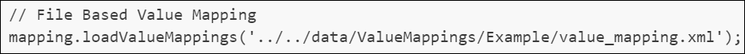

<!-- TOC start (generated with https://github.com/derlin/bitdowntoc) -->

- [Setup IntelliJ IDEA for Groovy Script](#setup-intellij-idea-for-groovy-script)
   * [Download IntelliJ IDEA and Groovy Script](#download-intellij-idea-and-groovy-script)
   * [Setup IntelliJ IDEA for Creating Groovy Script projects](#setup-intellij-idea-for-creating-groovy-script-projects)
   * [Create Code Templates](#create-code-templates)
      + [Groovy Script for CPI](#groovy-script-for-cpi)
      + [Groovy Script for Testing CPI Script](#groovy-script-for-testing-cpi-script)
      + [Groovy Script for Testing CPI Script and loading ValueMapping values from a file](#groovy-script-for-testing-cpi-script-and-loading-valuemapping-values-from-a-file)
   * [Create Test Examples](#create-test-examples)
      + [Value Mapping Example](#value-mapping-example)
      + [With inline value mapping values](#with-inline-value-mapping-values)
      + [With value mapping values from file](#with-value-mapping-values-from-file)
   * [Basic Project Layout](#basic-project-layout)
   * [Info about creation of Mapping.jar](#info-about-creation-of-mappingjar)

<!-- TOC end -->

<!-- TOC --><a name="setup-intellij-idea-for-groovy-script"></a>
# Setup IntelliJ IDEA for Groovy Script

<!-- TOC --><a name="download-intellij-idea-and-groovy-script"></a>
## Download IntelliJ IDEA and Groovy Script

* Download Latest versions via links below, or check the [files](./files) folder
* Download [SAP JVM](https://tools.hana.ondemand.com/#cloud)
* Download [Groovy Script 2.4.21](https://groovy.apache.org/download.html)
* Download [IntelliJ IDEA Community Edition](https://www.jetbrains.com/idea/download/?section=windows)
* Download [Script API](https://tools.hana.ondemand.com/#cloudintegration)
* Download and install [nvm / nodejs](https://github.com/coreybutler/nvm-windows/releases), this allows you to install multiple nodejs versions and switch between runtime versions.

 
<!-- TOC --><a name="setup-intellij-idea-for-creating-groovy-script-projects"></a>
## Setup IntelliJ IDEA for Creating Groovy Script projects

* Start IDEA and create a new Project
  * Name: GroovyScripts
  * Location: d:\
  * Language: Groovy
  * Build system: IntelliJ
  * JDK: sap-1.8, Point to c:\program files\sapjvm_8 folder
  * Groovy SDK: 2.4.21


* Configure the Modules in the Project Structure : choose: **File - Project Structure**
  * Goto **Project Settings - Modules**
  * Select Sources Tab
  * Unmark the *Sources* from the **src** folder
  * Create new **main** and **test** folders in the **src** folder
  * Mark the *Sources* to the **main** folder
  * Mark the *Tests* tab to the **test** folder
  * Create new **data** in the root folder
  * Create new **in** and **out** folders in the **data** folder
  
* Configure the Libraries in the Project Structure: choose: **File - Project Structure**
  * Download the three jar files from this Github files folder and put them in the **lib** folder of this project.
  * One by One add the following Java files to the project
    * camel-core-2.24.1
    * cloud.integration.script.apis-2.7.1.jar
    * cpi-mock-msg.jar
    * cpi-mapping-msg.jar
  * Add the following Maven file to the project
    * slf4j.simple:2.0.16 (latest version)
  * Press Apply to save the changes
  
* Restart IDEA

<!-- TOC --><a name="create-code-templates"></a>
## Create Code Templates
<!-- TOC --><a name="groovy-script-for-cpi"></a>
### Groovy Script for CPI
* Create a **Groovy Script for CPI** Code Template
  * In the menu bar, choose **File - Settings**
  * Then under **Editor - File and Code Templates** use the (+) Sign and add the script: **CPI Script**
  * and paste this code
``` Groovy Script
import com.sap.gateway.ip.core.customdev.util.Message;
import com.sap.it.api.mapping.ValueMappingApi;
import com.sap.it.api.ITApiFactory;
import groovy.xml.MarkupBuilder
import java.time.LocalDate
import java.time.format.DateTimeFormatter

def Message processData(Message message) {
    //Body
    Reader reader = message.getBody(Reader)
    def Order = new XmlSlurper().parse(reader)
    Writer writer = new StringWriter()
    def builder = new MarkupBuilder(writer)

    ValueMappingApi api = ITApiFactory.getService(ValueMappingApi, null)

    def sourceDocType = Order.Header.DocType  as String;

    def items = Order.Item.findAll { it.Valid.text() == 'true' }
    builder.PurchaseOrder {
            'Header' {
            'ID' Order.Header.OrderNumber
            'DocumentDate' LocalDate.parse(Order.Header.Date.text(), DateTimeFormatter.ofPattern('yyyyMMdd')).format(DateTimeFormatter.ofPattern('yyyy-MM-dd'))
           if (!items.size())
               'DocumentType' api.getMappedValue('S4', 'DocType', sourceDocType, 'ACME', 'DocumentType')
        }

        items.each { item ->
            'Item' {
                'ItemNumber' item.ItemNumber.text().padLeft(3, '0')
                'ProductCode' item.MaterialNumber
                'ProductDescription' api.getMappedValue('S4','ProductCode', item.MaterialNumber.text(),'ACME','Name')
                'Quantity' item.Quantity
            }
        }
    }

    message.setBody(writer.toString())
/*To set the body, you can use the following method. Refer SCRIPT APIs document for more detail*/
    //message.setBody(body + " Body is modified");
    //Headers
    def headers = message.getHeaders();
    def value = headers.get("oldHeader");
    message.setHeader("oldHeader", value + " modified");
    message.setHeader("newHeader", "newHeader");
    //Properties
    def properties = message.getProperties();
    value = properties.get("oldProperty");
    message.setProperty("oldProperty", value + " modified");
    message.setProperty("newProperty", "newProperty");
    return message;
}
```  
<!-- TOC --><a name="groovy-script-for-testing-cpi-script"></a>
### Groovy Script for Testing CPI Script
* Create a **Groovy Script for Testing CPI Script** Code Template
  * In the menu bar, choose **File - Settings**
  * Then under **Editor - File and Code Templates** use the (+) Sign and add the script: **Test CPI Script**
  * and paste this code
  * Here we set ValueMapping values directly in the test script
  
``` 
import com.sap.gateway.ip.core.customdev.util.Message
import com.sap.it.api.mapping.ValueMappingApi
import org.apache.camel.CamelContext
import org.apache.camel.Exchange
import org.apache.camel.impl.DefaultCamelContext
import org.apache.camel.impl.DefaultExchange

// Load Groovy Script
GroovyShell shell = new GroovyShell()
Script script1 = shell.parse(new File('../main/xxx.groovy'))
//Script script2 = shell.parse(new File('../main/yyy.groovy'))
//Script script3 = shell.parse(new File('../main/zzz.groovy'))
// Initialize CamelContext and exchange for the message
CamelContext context = new DefaultCamelContext()
Exchange exchange = new DefaultExchange(context)
Message msg = new Message(exchange)
// Initialize the message body with the input file
def body = new File('../../data/in/xxx.xml')
// Set exchange body in case Type Conversion is required
exchange.getIn().setBody(body)
msg.setBody(exchange.getIn().getBody())
// Set exchange headers
msg.setHeader("oldHeader", "oldHeaderValue")
// Set exchange properties
msg.setProperty("oldProperty", "oldPropertyValue")
// Set up value mapping entries
ValueMappingApi vmapi = ValueMappingApi.getInstance()
// Doctypes
vmapi.addEntry('S4', 'DocType', 'HDR', 'ACME', 'DocumentType', 'ACME-HDR')
vmapi.addEntry('S4', 'DocType', 'L15', 'ACME', 'DocumentType', 'ACME-M20')
vmapi.addEntry('S4', 'DocType', 'INV', 'ACME', 'DocumentType', 'ACME-INVOICE')
// ProductCodes
vmapi.addEntry('S4', 'ProductCode', 'M00001', 'ACME', 'Name', 'Beer')
vmapi.addEntry('S4', 'ProductCode', '21243', 'ACME', 'Name', 'Fruit')
vmapi.addEntry('S4', 'ProductCode', 'W12', 'ACME', 'Name', 'Wine')


// Execute script
script1.processData(msg)
//script2.processData(msg)
//script3.processData(msg)
exchange.getIn().setBody(msg.getBody())
// Display results of script in console
println("Body:\r\n${msg.getBody(String)}")
println('Headers:')
msg.getHeaders().each { key, value -> println("\$key = \$value") }
println('Properties:')
msg.getProperties().each { key, value -> println("\$key = \$value") }
```  

<!-- TOC --><a name="groovy-script-for-testing-cpi-script-and-loading-valuemapping-values-from-a-file"></a>
### Groovy Script for Testing CPI Script and loading ValueMapping values from a file
* Create a **Groovy Script for Testing CPI Script and loading ValueMapping values from a file** Code Template
  * In the menu bar, choose **File - Settings**
  * Then under **Editor - File and Code Templates** use the (+) Sign and add the script: **Test CPI with Loading ValueMapping**
  * and paste this code
  * Here we set ValueMapping values by loading then from a file, the extra option at the end of the function shows the loaded Value Mappings in the result.

  *This file can be extraced from the zip file when you download a ValueMapping from CPI.

    
```
import com.sap.gateway.ip.core.customdev.util.Message
import com.sap.it.api.mapping.ValueMappingApi
import org.apache.camel.CamelContext
import org.apache.camel.Exchange
import org.apache.camel.impl.DefaultCamelContext
import org.apache.camel.impl.DefaultExchange

// Load Groovy Script
GroovyShell shell = new GroovyShell()
Script script1 = shell.parse(new File('../main/xxx.groovy'))
//Script script2 = shell.parse(new File('../main/yyy.groovy'))
//Script script3 = shell.parse(new File('../main/zzz.groovy'))
// Initialize CamelContext and exchange for the message
CamelContext context = new DefaultCamelContext()
Exchange exchange = new DefaultExchange(context)
Message msg = new Message(exchange)
// Initialize the message body with the input file
def body = new File('../../data/in/xxx.xml')
// Set exchange body in case Type Conversion is required
exchange.getIn().setBody(body)
msg.setBody(exchange.getIn().getBody())
// Initialize ValueMapping with input file
ValueMappingApi vmapi = ValueMappingApi.getInstance();
loadValueMappings('../../data/ValueMappings/Example/value_mapping.xml',true);

// Set exchange headers
msg.setHeader("oldHeader", "oldHeaderValue")
// Set exchange properties
msg.setProperty("oldProperty", "oldPropertyValue")
// Set up custom value mapping entries
//vmapi.addEntry(sourceAgency, sourceSchema, sourceValue, targetAgency, targetSchema, targetValue)
//vmapi.addEntry('S4', 'DocType', 'HDR', 'ACME', 'DocumentType', 'ACME-HDR')


// Execute script
script1.processData(msg)
//script2.processData(msg)
//script3.processData(msg)
exchange.getIn().setBody(msg.getBody())
// Display results of script in console

println("Body:\r\n${msg.getBody(String)}")
println('Headers:')
msg.getHeaders().each { key, value -> println("\$key = \$value") }
println('Properties:')
msg.getProperties().each { key, value -> println("\$key = \$value") }


def loadValueMappings(iFilename, iShow = false){
    ValueMappingApi vmapi = ValueMappingApi.getInstance();
    def vMappingFile = new File(iFilename);
    def vMapping = new XmlSlurper().parse(vMappingFile)
    def vGroups = vMapping.children()
    println("ValueMapping values from file: " + iFilename)
    vGroups.each { group ->
        if (iShow == true) {
            println(group.entry[0].agency.text() + " " +
                    group.entry[0].schema.text() + " " +
                    group.entry[0].value.text() + " " +
                    group.entry[1].agency.text() + " " +
                    group.entry[1].schema.text() + " " +
                    group.entry[1].value.text())
        }
        vmapi.addEntry(group.entry[0].agency.text(),
                group.entry[0].schema.text(),
                group.entry[0].value.text(),
                group.entry[1].agency.text(),
                group.entry[1].schema.text(),
                group.entry[1].value.text())
    }
}

```

<!-- TOC --><a name="create-test-examples"></a>
## Create Test Examples
<!-- TOC --><a name="value-mapping-example"></a>
### Value Mapping Example
* **DocType**

* **ProductCode**


<!-- TOC --><a name="with-inline-value-mapping-values"></a>
### With inline value mapping values
In this test example we are mocking the Value Mappings in the test script:

* In folder **in** create a new file **xxx.xml** and put in the following code
```
    <Order>
        <Header>
            <OrderNumber>4900000045</OrderNumber>
            <DocType>HDR</DocType>
            <Date>20241004</Date>
        </Header>
        <Item>
            <Valid>true</Valid>
            <ItemNumber>1</ItemNumber>
            <MaterialNumber>M00001</MaterialNumber>
            <Quantity>12.5</Quantity>
        </Item>
        <Item>
            <Valid>true</Valid>
            <ItemNumber>2</ItemNumber>
            <MaterialNumber>21243</MaterialNumber>
            <Quantity>40</Quantity>
        </Item>
    </Order>
```  
  * In folder **src/main** right click and select **New - CPI Script** and name it **xxx** 
  * In folder **src/test** right clikc and select **New - Test CPI Script** and name it also **xxx**
    * Mock Value Mappings
    
  * run your test script
    * Right click on the **xxx.groovy** file in the **test** folder and select **Run 'xxx'**
    * This should give you the following result:


<!-- TOC --><a name="with-value-mapping-values-from-file"></a>
### With value mapping values from file
* In this test example we are mocking the Value Mappings by loading a ValueMapping file into the test script:
* We will user the same input file and main file as in the previous example **xxx.xml** & **xxx.groovy**
* But we will create a new test script **Test CPI with Loading ValueMapping**
* In folder **src/test** right clikc and select **New - Test CPI with Loading ValueMappingt** and name it **xxxExtra**
* Create an new folder **ValueMappings** in the folder **data**
* Create a new folder **Example** in the folder **ValueMappings**
* Copy the file **value_mapping.xml** that is in this Github folder files and save it in the new folder **Example**
* This test script loads the valueMapping.xml file and shows the value mappings in the output

* run your test script
    * Right click on the **xxxExtra.groovy** file in the **test** folder and select **Run 'xxxExtra'**
    * This should give you the following result:


<!-- TOC --><a name="basic-project-layout"></a>
## Basic Project Layout


<!-- TOC --><a name="info-about-creation-of-mappingjar"></a>
## Info about creation of Mapping.jar
[https://github.com/equaliseit/sap-cpi-mocks/tree/main](https://github.com/equaliseit/sap-cpi-mocks/tree/main)